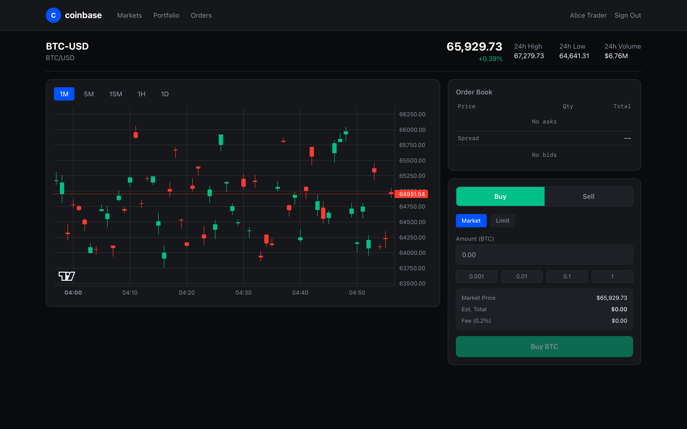

# Coinbase: a simulated spot exchange

A local learning project with a market overview, candlestick chart, order book, buy/sell form, portfolio, and order history. Prices and deposits are simulated; there is no connection to Coinbase, a blockchain, a bank, or a real market-data provider.

The project demonstrates price-time sorting, conditional wallet reservation, WebSocket broadcasting, and relational order records. It does **not** provide consistent exchange accounting: matching, order updates, and wallet settlement can diverge, and monetary calculations use JavaScript numbers despite decimal database columns. [Implementation Notes](./architecture.md#implementation-notes) explain these limits.

## What you can explore

- Browse twelve configured trading pairs, including ten USD pairs and two crypto-to-crypto pairs.
- Register or sign in, place market/limit orders, and inspect or cancel open orders.
- View simulated prices, an in-memory order book, and stored candlesticks. The seed supplies one-minute candles for BTC-USD, ETH-USD, and SOL-USD only.
- Inspect wallet totals, available balances, and a portfolio allocation bar. Portfolio history and transaction history have API endpoints but no corresponding history screens.
- Add simulated funds through the authenticated deposit API. There is no deposit button, withdrawal API, custody, or administrator interface.

Stop orders are accepted by the API but never triggered or added to the book. Do not use them as a working feature; a cancelled buy stop also fails to release its reserve. The timeframe buttons include intervals for which neither the seed nor the worker produces candles.



The screenshot is a checked-in visual example, not evidence of current accounting correctness or live market prices.

## Stack and documentation

| Layer | Implementation |
|-------|----------------|
| Frontend | React 19, TypeScript, Vite 6, TanStack Router, Zustand 5, Tailwind CSS 3 |
| Charts | TradingView Lightweight Charts 5; SVG sparklines with generated data |
| API | Node.js 20+, Express 4, TypeScript/tsx, ESM |
| Data | PostgreSQL 16; numeric(28,18) columns with floating-point application calculations |
| Sessions | Valkey 7, ioredis, connect-redis, express-session |
| Streaming | ws for browser prices; KafkaJS publishes optional events |
| Operations | Pino, prom-client, express-rate-limit, Vitest |

[architecture.md](./architecture.md) separates a proposed production design from the source. The [frontend](./system-design-answer-frontend.md), [backend](./system-design-answer-backend.md), and [fullstack](./system-design-answer-fullstack.md) answers provide spoken interview discussions. [CLAUDE.md](./CLAUDE.md) records development history; several historical implementation claims are outdated.

## Infrastructure

Start in the repository root and choose one option. Subsequent setup terminals start in `coinbase` unless stated otherwise. Other projects may already occupy the default infrastructure ports.

### Option A: Docker Compose (recommended)

```bash
cd coinbase
docker compose up -d
docker compose ps
```

| Service | Address | Development credentials |
|---------|---------|-------------------------|
| PostgreSQL | localhost:5432, database coinbase | coinbase / coinbase123 |
| Valkey | localhost:6379 | No authentication |
| Kafka | localhost:9092 | Plaintext, no authentication |
| ZooKeeper | localhost:2181 | Used by this Compose Kafka deployment |

On a fresh PostgreSQL volume, Compose applies [init.sql](./backend/src/db/init.sql), creating nine tables, thirteen currencies, twelve pairs, and indexes. It does not create users, wallets, orders, or candles. **Do not run db:migrate after this initialization:** the script reexecutes non-idempotent CREATE TABLE statements and fails on existing tables.

PostgreSQL and Valkey have named volumes; Valkey enables AOF. Kafka and ZooKeeper have no persistent volume mounts, and Kafka uses a single broker. Their container replacement is not durable event recovery.

```bash
docker compose exec -T kafka kafka-topics --bootstrap-server localhost:9092 --list
docker compose down
# Deliberately reset PostgreSQL and Valkey data as well:
docker compose down -v
```

The broker has no Compose health check; container presence is not broker readiness. The API does not consume Kafka events, and its browser price loop works independently.

### Option B: Native installation on macOS

```bash
cd coinbase
brew install postgresql@16 valkey kafka
brew services start postgresql@16
brew services start valkey
brew services start kafka
export PATH="$(brew --prefix postgresql@16)/bin:$PATH"
psql postgres -c "CREATE USER coinbase WITH PASSWORD 'coinbase123';"
createdb -O coinbase coinbase
PGPASSWORD=coinbase123 psql -h localhost -U coinbase -d coinbase -v ON_ERROR_STOP=1 -f backend/src/db/init.sql
pg_isready -h localhost -p 5432
valkey-cli ping
kafka-topics --bootstrap-server localhost:9092 --list
```

These commands assume the current macOS account can administer PostgreSQL. Skip role/database creation if they exist, and apply initialization only to an empty database.

The current [Homebrew Kafka package](https://formulae.brew.sh/formula/kafka) uses Kafka 4 and KRaft rather than this Compose deployment's ZooKeeper arrangement. Its [formula](https://github.com/Homebrew/homebrew-core/blob/HEAD/Formula/k/kafka.rb) initializes fresh storage and starts the supplied server configuration. Do not add a ZooKeeper service or reformat existing Kafka storage as part of ordinary startup.

## Start the API and frontend

API terminal, initially in `coinbase`:

```bash
cd backend
npm install
npm run dev
```

Frontend terminal, initially in `coinbase`:

```bash
cd frontend
npm install
npm run dev
```

Open [localhost:5173](http://localhost:5173). The API and WebSocket endpoint use port **3001**; Vite proxies `/api` and `/ws` there. Anonymous browsing works without a user account. Registration creates a zero-balance USD wallet, so import the optional fixture for a funded demo.

### Optional workers

In separate terminals initially in `coinbase/backend`:

```bash
npm run dev:worker:price
```

```bash
npm run dev:worker:portfolio
```

The price worker runs its own random price simulation, publishes `price-updates`, and attempts to persist completed one-minute candles. It is not the source of the API's displayed prices. Its current-candle rollover can discard a candle before the persistence timer reads it.

The portfolio worker writes snapshots immediately and every 60 seconds using a third, independently initialized price map that it never ticks or updates from Kafka. The UI does not display these history snapshots. Both workers use asynchronous interval callbacks without overlap prevention.

### Configuration

The API and workers load `.env` from their working directory through dotenv, or use exported variables. Defaults:

```bash
export PGHOST=localhost PGPORT=5432 PGDATABASE=coinbase
export PGUSER=coinbase PGPASSWORD=coinbase123
export REDIS_HOST=localhost REDIS_PORT=6379
export KAFKA_BROKERS=localhost:9092 KAFKA_CLIENT_ID=coinbase-api
export SESSION_SECRET=coinbase-dev-secret-key-change-in-production
export PORT=3001 NODE_ENV=development
```

`DATABASE_URL` and `REDIS_URL` are not read. The migration runner reads PG* environment variables directly and does not load dotenv. The active database pool has 20 connections and a two-second connection timeout.

`npm run dev` explicitly sets port 3001. The `dev:server2` and `dev:server3` scripts call it after setting another port, so the inner command resets both to 3001. For an isolated port experiment, `PORT=3002 NODE_ENV=development npx tsx src/index.ts` uses that port, but it also creates an independent price simulation and order book. Multiple API instances are not a coherent shared exchange, and no load balancer is provided.

## Optional demo data

After fresh initialization, run one of these commands from `coinbase`:

```bash
# Docker:
docker compose exec -T postgres psql -U coinbase -d coinbase -v ON_ERROR_STOP=1 < backend/db-seed/seed.sql
# Native alternative:
PGPASSWORD=coinbase123 psql -h localhost -U coinbase -d coinbase -v ON_ERROR_STOP=1 -f backend/db-seed/seed.sql
```

Use the command for your chosen infrastructure. [The fixture](./backend/db-seed/seed.sql) creates two verified demo accounts and fifteen wallets, 180 one-minute candles across BTC/ETH/SOL on a fresh import, and five sample deposit records. It creates no orders, trades, resting liquidity, or portfolio snapshots.

| Username | Password | Example starting balances |
|----------|----------|---------------------------|
| alice | password123 | 100,000 USD, 1.5 BTC, 10 ETH, 100 SOL, plus five other assets |
| bob | password123 | 100,000 USD, 0.5 BTC, 5 ETH, 50 SOL, 25,000 DOGE, 10,000 XRP |

The shared bcrypt hash was verified in isolation. Login uses username, not email. Repeated seeding preserves existing wallet balances, may add newly timed candles, and appends duplicate deposit-history records. If these usernames already belong to different UUIDs, the fixed wallet references can fail; import before registering those names.

The deposit-history fixture is not a complete journal of every seeded wallet. A new user can instead call the authenticated deposit API with a currency and amount; amounts are simulated, capped at 1,000,000 per request, and have no funding-provider verification or idempotency.

## Verification

```bash
curl -s http://localhost:3001/api/v1/health
curl -s http://localhost:3001/metrics
```

Health returns a fixed healthy response without checking the database, Redis, Kafka, book recovery, or settlement consistency. It also runs behind session middleware and the general API rate limiter.

Backend scripts include `npm run build`, `npm test`, and `npm run lint`. Frontend scripts include `npm run build`, `npm run lint`, and `npm run preview`. The backend's fifteen mocked HTTP tests cover route shape, validation, and unauthenticated access; they do not exercise successful settlement, concurrent matching, or database recovery.

From the repository root, `npm run test:smoke coinbase` runs seven page checks against an already running stack and seeded Alice account. Their container assertions do not prove trading or chart correctness. The project-level `test:e2e` can start Vite but does not start infrastructure or the API.

## Important implementation boundaries

- Reservation and order insertion are separate writes. Matching mutates the in-memory book before trade insertion, order updates, and wallet settlement complete. Failures can leave orphan reserves or divergent records; restart does not rebuild open orders into the book.
- Matched buyer fees are computed in quote currency and subtracted directly from base quantity. Market fallback creates a synthetic fill without a counterparty or trade row and leaves the already filled order in the book. Limit-price improvements can leave unused reserves locked.
- Price, quantity, fee, and valuation calculations use floating point. Decimal columns and some string responses do not make the full path exact. Crypto-to-crypto prices are incorrectly labelled with dollar signs in several views.
- Idempotency uses a global unbound Redis response key without a lock or durable result lookup. The browser creates a new timestamp/random key for each submission rather than preserving an attempt through recovery.
- Browser prices, persisted candles, and portfolio-worker valuations come from separate process-local price maps. “24h” statistics are synthetic cumulative/process-lifetime values, and overview sparklines are newly generated on render.
- The development StrictMode effect cleanup removes the WebSocket price handler, while a ref prevents it from being registered again. Other request races can mix symbols or accounts. The chart is recreated when its candle array changes; it does not receive live candle updates.
- WebSocket auth trusts a supplied user ID and arbitrary channel subscriptions. No private order/book events are currently published, but those helpers are not an authorization boundary. HTTP cookies remain insecure even in production configuration; no admin or account-verification workflow exists.

This review inspected source/configuration and ran isolated password, matching, arithmetic, and candle-lifecycle checks. It did not start the exchange, execute its SQL fixture, run browser tests, or validate live settlement. The detailed architecture records these findings without treating proposed production mechanisms as implemented features.
