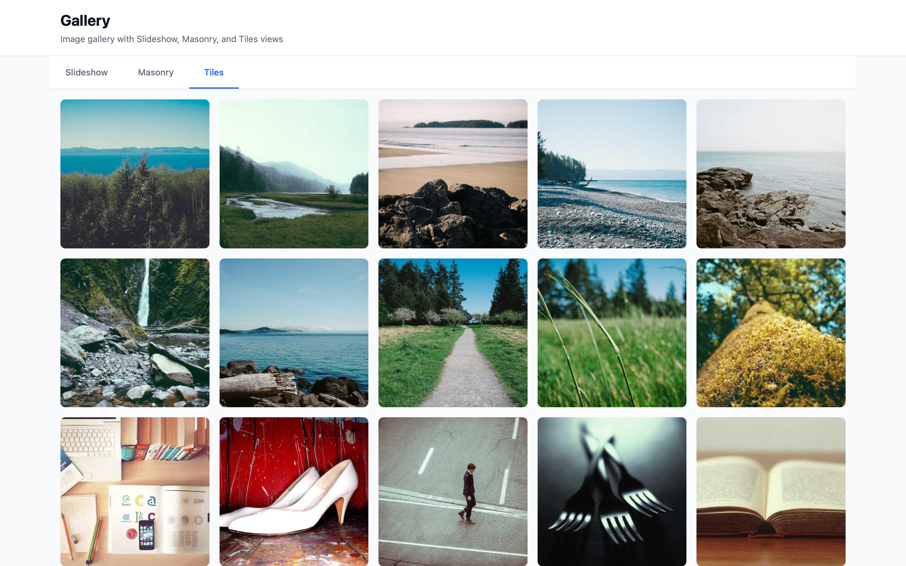
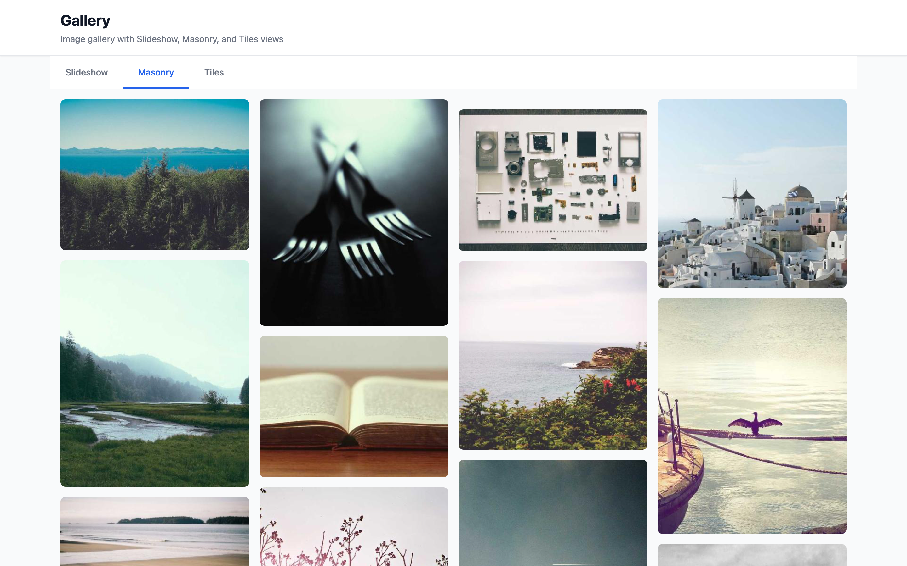
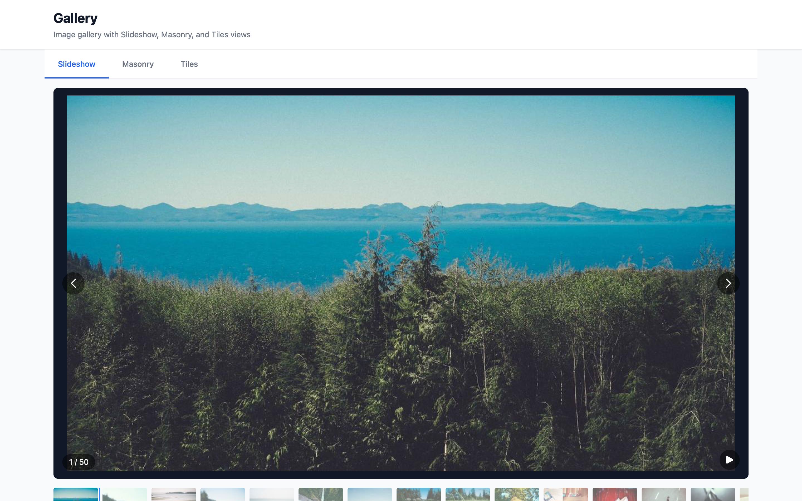

# Gallery

A frontend-only React project for comparing three ways to browse the same 50 placeholder images: a slideshow, a masonry-style column layout, and a square tile grid. It is a small layout and interaction exercise, with a shared lightbox and in-memory UI state.

The application has no backend, database, upload pipeline, authentication, albums, or search. Images load directly from [Lorem Picsum](https://picsum.photos/). The larger service described in the architecture and backend/fullstack interview answers is a proposed extension.

## What is implemented

| View | Behavior | Boundary |
|---|---|---|
| Tiles, the default | Square image buttons; 2/3/4/5 columns across responsive breakpoints | Fixed 300×300 image requests; no responsive candidate selection |
| Masonry | CSS columns; 2 columns initially, 3 at medium, 4 at large widths | Column-first order; synthetic image proportions and no reserved intrinsic dimensions |
| Slideshow | In-page 16:9 image area, arrows, 50 thumbnails, play/pause | Fixed three-second autoplay; no adjacent-image preloading |
| Lightbox | Viewport overlay from a tile/masonry button, arrows, counter, Escape/backdrop close | No focus trap, focus restoration, modal semantics, or touch gestures |

Tiles and masonry use native `loading="lazy"`. The slideshow main image, thumbnails, and lightbox image do not. Lazy loading defers some image requests; it does not remove the 50 rendered items or guarantee that only visible images download.

Slideshow is an in-page carousel, not browser fullscreen. Its main image does not open the lightbox. Switching views mounts only the selected view. The slideshow index survives a tab switch, while its local playing flag resets to paused when the slideshow remounts. Refresh resets all state to Tiles and the first slide; the selected view/image is not encoded in the URL.

## Run locally

From the repository root, with Node.js 20+ and npm:

```bash
cd gallery/frontend
npm install
npm run dev -- --host 127.0.0.1 --port 5173 --strictPort
```

Open [Gallery](http://localhost:5173). The explicit port makes the address predictable; the checked-in Vite configuration otherwise uses Vite defaults and can select another available port.

Internet access to Picsum and its image delivery hosts is required for uncached pictures. The page can load while image requests fail, and the application has no custom image-error/retry UI or bundled offline photo set. Fixed IDs do not guarantee the external service will always serve every image.

**Infrastructure:** neither Docker Compose nor native database/cache services are needed. This project contains no Compose file, backend package, migrations, or environment-variable configuration. The native Node/Vite workflow above is the complete local setup.

For a local preview of a generated build, from `gallery/frontend/`:

```bash
npm run build
npm run preview -- --host 127.0.0.1 --port 4173 --strictPort
```

Open [the build preview](http://localhost:4173). This is a local development preview command, not a deployment performed by this review.

## Stack and source map

React 19, TypeScript, Vite 6, TanStack Router, Zustand 5, and Tailwind CSS 3. There is one route, `/`; view switching happens in Zustand rather than through routes.

| Source | Responsibility |
|---|---|
| [routes/index.tsx](./frontend/src/routes/index.tsx) | View selection and conditional mounting |
| [routes/__root.tsx](./frontend/src/routes/__root.tsx) | Page shell and shared lightbox placement |
| [GalleryTabs.tsx](./frontend/src/components/gallery/GalleryTabs.tsx) | Ordinary buttons styled as view tabs |
| [Slideshow.tsx](./frontend/src/components/gallery/Slideshow.tsx) | Main image, thumbnails, keyboard handler, interval |
| [MasonryGrid.tsx](./frontend/src/components/gallery/MasonryGrid.tsx) | CSS multi-column image buttons |
| [TilesGrid.tsx](./frontend/src/components/gallery/TilesGrid.tsx) | Responsive square grid |
| [Lightbox.tsx](./frontend/src/components/gallery/Lightbox.tsx) | Fixed inline overlay and body scroll lock |
| [galleryStore.ts](./frontend/src/stores/galleryStore.ts) | Active view, slide index, lightbox ID, hardcoded count |
| [picsum.ts](./frontend/src/utils/picsum.ts) | Image IDs, URL construction, synthetic masonry heights |

The lightbox is rendered as a sibling of the main content in the root layout. It does not use a portal. No TanStack Query, Zod, IntersectionObserver, virtualization, or API client is installed or implemented here.

## Controls and accessibility limits

| Context | Control | Action |
|---|---|---|
| View buttons | Click or native keyboard activation | Switch Slideshow / Masonry / Tiles |
| Tile or masonry image button | Click, Enter, or Space | Open that image in the lightbox |
| Slideshow mounted | Left / Right arrow | Previous / next slide, wrapping at either end |
| Slideshow mounted | Space | Toggle autoplay |
| Slideshow thumbnail | Click or native button activation | Jump to its image |
| Lightbox open | Left / Right arrow | Previous / next image |
| Lightbox open | Escape, close button, or backdrop click | Close the overlay |

Native buttons and arrow/close labels provide some keyboard access, but this is not a complete accessible modal/carousel implementation. Focus is not moved into or constrained by the lightbox, background controls remain keyboard-reachable, and images have generic numbered descriptions. Slideshow shortcuts are window-wide, including while other controls have focus. Autoplay does not pause on focus, hover, hidden tabs, or reduced-motion preference. These are known implementation limits, not completed features.

## Image sizes and customization

| Context | Requested dimensions |
|---|---|
| Tiles | 300×300 |
| Masonry | Width 400; height 300, 400, 500, 600, 320, or 480 according to ID |
| Slideshow | 1200×675 |
| Thumbnail strip | 80×56 |
| Lightbox | 1920×1080 |

The list contains IDs 10–59. `getAspectRatio` actually returns a height/width multiplier selected by `id % 6`; it does not read a photo's original dimensions. `getImageInfoUrl` and random-image helpers exist but are unused. There are no `srcset`, `sizes`, or `<picture>` elements.

If changing the list in [picsum.ts](./frontend/src/utils/picsum.ts), also keep `totalImages` in [galleryStore.ts](./frontend/src/stores/galleryStore.ts) consistent and reset/clamp the selected index. The store currently hardcodes 50 and does not validate setters. Changing only the image list can generate requests containing `undefined`. A production version should derive counts and selection from metadata rather than keep duplicate constants.

## Development checks

| Command, from `gallery/frontend/` | What it does |
|---|---|
| `npm run build` | `tsc -b` across referenced app/config projects, then Vite build |
| `npx tsc -p tsconfig.app.json --noEmit` | Explicit application source type check |
| `npm run type-check` | Current `tsc --noEmit` script; root config has no files and does not traverse references in this mode |
| `npm run lint` | Declared `eslint .` script; no ESLint configuration is checked in for this project or its repository ancestors |

No unit/smoke-test package exists in this project. The repository [screenshot configuration](../scripts/screenshot-configs/gallery.json) switches among the three layouts, but waits for elements and delays rather than checking that every image decoded or that the lightbox works. Do not interpret existing captures as a fresh successful runtime test.

The documentation review checked source/configuration, links, and isolated store/component behavior with mocked React/browser dependencies. It did not run a production build, start the application, or benchmark image loading.

## Existing screenshots

| Tiles | Masonry | Slideshow |
|---|---|---|
|  |  |  |

## Design documents

- [Architecture](./architecture.md): proposed growth path and precise local implementation.
- [Frontend interview](./system-design-answer-frontend.md): layouts, image loading, and modal/navigation behavior.
- [Backend interview](./system-design-answer-backend.md): proposed processing, publication, and delivery service.
- [Fullstack interview](./system-design-answer-fullstack.md): image metadata, upload state, and the browsing experience.
- [CLAUDE.md](./CLAUDE.md): development history and earlier decisions.

For current source-size statistics, run `npm run sloc gallery` from the repository root.
