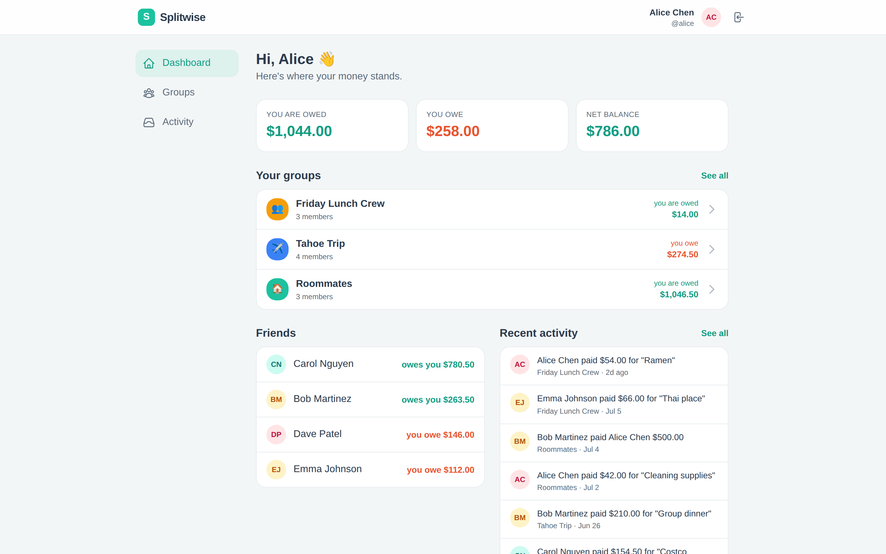

# Splitwise

A shared-expense tracker: create groups, log expenses split four ways (equal / exact / percentage / shares), see who owes whom, **simplify debts** into the fewest payments, and record settlements.

Built as a full-stack demo — **React + TypeScript** front end (the split editor is the centerpiece), **Node + Express + PostgreSQL + Redis** back end. See [`architecture.md`](./architecture.md) for the design and [`CLAUDE.md`](./CLAUDE.md) for iteration notes.



## Codebase Stats

| Metric | Value |
|--------|-------|
| Total SLOC | 5,579 |
| Source Files | 80 |
| .ts | 2,711 |
| .tsx | 1,763 |
| .md | 652 |
| .sql | 143 |
| .json | 140 |

## What it does

- **Groups** — roommates, a trip, a couple; each member sees their net balance.
- **Expenses** — one person pays, the cost is split among participants. Four split modes with a live editor that shows exact per-person cents as you type and refuses to save until the parts sum to the total.
- **Balances & Simplify** — each member's net position, and a min-cash-flow simplification that collapses a tangle of IOUs into the fewest payments.
- **Settle up** — record a payment between two people (optionally prefilled from a suggested transfer).
- **Dashboard & Activity** — totals (you're owed / you owe / net), per-friend balances, and a cross-group activity feed.

Money is integer cents end-to-end; balances are always derived from the immutable expense/settlement log; add-expense and settle-up are idempotent.

## Tech Stack

| Layer | Tech |
|-------|------|
| Frontend | React 19, TypeScript, Vite, TanStack Router, Zustand, Tailwind CSS |
| Backend | Node.js, Express, TypeScript |
| Database | PostgreSQL 16 |
| Cache / sessions | Redis (Valkey) |
| Observability | Prometheus (`prom-client`), Pino |

## Quick Start

### 1. Start infrastructure

**Option A — Docker Compose (recommended)**
```bash
docker-compose up -d          # PostgreSQL :5432, Valkey :6379
# docker-compose down          (stop)
# docker-compose down -v       (stop + wipe data)
```

**Option B — Native (no Docker, macOS/Homebrew)**
```bash
brew install postgresql@16 valkey
brew services start postgresql@16 && brew services start valkey
createuser -s splitwise 2>/dev/null; psql -d postgres -c "ALTER USER splitwise PASSWORD 'splitwise_password';"
createdb -O splitwise splitwise
```

### 2. Backend

```bash
cd backend
cp .env.example .env           # defaults match docker-compose
npm install
npm run db:migrate             # create tables
npm run seed                   # load demo users, groups, expenses
npm run dev                    # API on http://localhost:3000
```

### 3. Frontend

```bash
cd frontend
npm install
npm run dev                    # app on http://localhost:5173
```

Open **http://localhost:5173** and log in with the demo account (the form is pre-filled):

| Email | Password |
|-------|----------|
| `alice@example.com` | `password123` |

Other seeded users (same password): `bob@`, `carol@`, `dave@`, `emma@` `example.com`.

## Environment Variables

```bash
POSTGRES_HOST=localhost
POSTGRES_PORT=5432
POSTGRES_USER=splitwise
POSTGRES_PASSWORD=splitwise_password
POSTGRES_DB=splitwise
REDIS_HOST=localhost
REDIS_PORT=6379
PORT=3000
```

## Project Structure

```
splitwise/
├── backend/
│   └── src/
│       ├── index.ts             # Express app + health/metrics
│       ├── db/                  # pool, redis, init.sql, migrate, seed
│       ├── middleware/auth.ts   # session auth + group-membership guard
│       ├── shared/              # logger, metrics, idempotency
│       ├── services/            # splits.ts (split math), balances.ts (net + simplify)
│       └── routes/              # auth, groups, expenses, settlements, activity, dashboard
├── frontend/
│   └── src/
│       ├── routes/              # TanStack file routes (dashboard, groups, group detail, activity)
│       ├── components/          # Layout, Avatar, Modal, expense/*, group/*, icons/*
│       ├── services/api.ts      # typed API client (idempotency keys included)
│       ├── stores/              # Zustand auth store
│       └── utils/               # currency, dates, largest-remainder allocation
├── docker-compose.yml
└── architecture.md
```

## Key Endpoints

```
GET  /api/dashboard                    Totals + per-friend balances
GET  /api/groups                       My groups (badged with my balance)
POST /api/groups                       Create a group
GET  /api/groups/:id/balances          Net balances + simplified transfers
POST /api/expenses                     Add an expense  (Idempotency-Key)
POST /api/settlements                  Record a payment (Idempotency-Key)
GET  /api/activity                     Cross-group activity feed
GET  /health/detailed                  Postgres + Redis health
GET  /metrics                          Prometheus metrics
```

## Testing

```bash
# Backend type-check
cd backend && npm run type-check

# Frontend build (type-checks + bundles)
cd frontend && npm run build

# Smoke tests (Playwright) — frontend must be running, or use test:e2e
npm install
npm run test:e2e
```

## Notes

- Balances are **never stored** — they are derived from expenses + settlements and cached in Redis (invalidated on write). This keeps a single source of truth.
- All money is **integer cents**; splits use the largest-remainder method so the parts always sum to the total.
- **Splitwise records payments, it does not move money** — settlements are ledger entries, not transfers.
